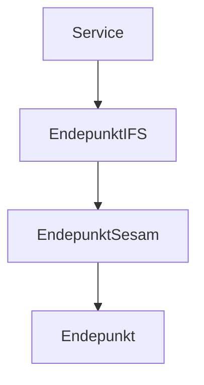

## Prerequisites
- .NET 9.0
- docker

Start docker
``` command
docker run --rm -it -p 18888:18888 -p 4317:18889 -d --name aspire-dashboard -e DOTNET_DASHBOARD_UNSECURED_ALLOW_ANONYMOUS='true' mcr.microsoft.com/dotnet/nightly/aspire-dashboard:8.0.0-preview.6
```

Copy the following code to a bat file and run as administrator

``` code
start cmd.exe /k "Color 1F & title Service & cd C:\dev\ResilienceWithRetries\Service & dotnet run"
start cmd.exe /k "Color 2F & title Endepunkt & cd C:\dev\ResilienceWithRetries\Endepunkt & dotnet run"
start cmd.exe /k "Color 3F & title EndepunktIFS & cd C:\dev\ResilienceWithRetries\EndepunktIFS & dotnet run"
start cmd.exe /k "Color 5F & title EndepunktSesam & cd C:\dev\ResilienceWithRetries\EndepunktSesam & dotnet run"
```



Look in the Service command window to get the URL, e.g. `Now listening on: http://localhost:5160`
Add swagger to the URL to open a user-friendly interface, http://localhost:5160/swagger

In order to see the trace, go to http://localhost:18888/traces