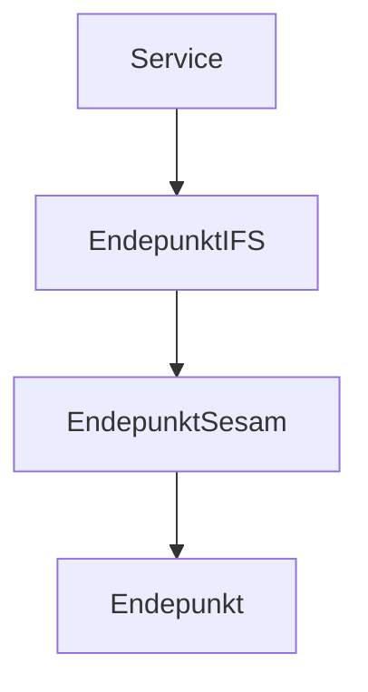

docker run --rm -it -p 18888:18888 -p 4317:18889 -d --name aspire-dashboard -e DOTNET_DASHBOARD_UNSECURED_ALLOW_ANONYMOUS='true' mcr.microsoft.com/dotnet/nightly/aspire-dashboard:8.0.0-preview.6

start cmd.exe /k "Color 1F & title Service & cd C:\repos\ResilienceWithRetries\Service & dotnet run"
start cmd.exe /k "Color 2F & title Endepunkt & cd C:\repos\ResilienceWithRetries\Endepunkt & dotnet run"
start cmd.exe /k "Color 3F & title EndepunktIFS & cd C:\repos\ResilienceWithRetries\EndepunktIFS & dotnet run"
start cmd.exe /k "Color 5F & title EndepunktSesam & cd C:\repos\ResilienceWithRetries\EndepunktSesam & dotnet run"

